# PRACTICA APRENDIZAJE NO SUPERVISADO

<div style="text-align: right"></div>

## AUTORES

Grupo 25:

* Guillermo Criado Morato

* Angelo Villar Arias

---

## INDICE

0. [DESCRIPCIÓN DEL DATASET](#0-descripción-del-dataset)
    1. [Preprocesamiento de los datos](#01-preprocesamiento)
    2. [Descripción del dataset](#02-descripción-e-informacion-de-las-variables-del-dataset)
    3. [Histogramas](#03-histogramas)
    4. [Boxplot](#04-boxplot)
    5. [Scatter  plot](#05-scatter-plot)
    6. [Reducción de la información del dataset](#06-reducción-de-la-información-del-dataset)
    7. [Matriz de similaridad](#07-matriz-de-similaridad)
1. [APLICACIÓN DE ALGORITMOS DE CLUSTERING JERÁRQUICO](#1-aplicación-de-algoritmos-de-clustering-jerárquico)
    1. [Algoritmos de clustering jerárquico](#12-algoritmos-de-clustering-jerárquico)
    2. [Calidad del clustering](#13-calidad-del-clustering)
    3. [Número de clusters](#14-número-de-clusters)
    4. [Predicción](#15-predicción)
2. [APLICACIÓN DE ALGORITMOS DE CLUSTERING PARTICIONAL](#2-aplicación-de-algoritmos-de-clustering-particional)
    1. [Preprocesado](#21-preprocesado)
    2. [Establecer número de clusters y variación](#22-establecer-número-de-clusters-y-variación)
    3. [Estadísticas de los clusters](#23-estadísticas-de-los-clusters)
3. [APLICACIÓN ALGORITMOS DE DENSIDAD](#3-aplicación-algoritmos-de-densidad)
    1. [Preprocesado](#31-preprocesado)
    2. [Establecer radio (eps) y número de puntos minimo adecuado](#32-establecer-radio-eps-y-número-de-puntos-minimo-adecuado)
    3. [Calidad del clustering](#33-calidad-del-clustering)

4. [OTROS](#4-otros)
    1. [Preprocesado](#41-preprocesado)
    2. [HDBScan](#42-hdbscan)
    3. [K-Modes](#43-kmodes)

## 0. DESCRIPCIÓN DEL DATASET

Correspondiente con:

- **Tarea1**: Realiza un análisis descriptivo del dataset. Analiza la distribución de los datos
por cada una de las columnas, realiza los pasos de pre-procesamiento necesarios,
justificando adecuadamente las acciones tomadas. Se deberá hacer uso de gráficas para
entender los datos y las decisiones adoptadas.

### 0.1 Preprocesamiento

Como en el guión de la práctica se nos dice que se puede prescindir de las variables A0, A0_1, A0_7 y factoregatur, decidimos eliminarlas del dataset.

Seguidamente limpiamos de valores nulos el dataset.

### 0.2 Descripción e informacion de las variables del dataset

Nos encontramos con un dataset de 9 variables de tipo entero menos la variable "gastototal" que es de tipo float. Tenemos un total de 621218 de ejemplos por variable.

### 0.3 Histogramas

Aquí vemos los histogramas de cada una de las variables.


### 0.4 Boxplot

Como con el histograma queda muy claro la variable "gastotoal" se ha hecho un boxplot para ver la distribución de valores de la variable


Como se observa, el gasto total se centra en el intervalo de 0 a 10000

### 0.5 Scatter plot

De cara a veribicar gráficamente la reducción de datos se hace el Scatter plot de la variable "gasto total" frente a "A13" que represeta el número de pernoctaciones.


Se pueden distinguir 4 clusters.

### 0.6 Reducción de la información del dataset

Tras analizar y describir el dataset decidimos reducir la cantidad de datos con un undersampling.

Esto es debido a que debido a la gran cantidad de datos que tenemos el motor de compilación de Google Collab se colapsará al entrenar los algoritmos. Inicialmente apostamos por un ``` frac=0.01 ``` pero como había pocos datos para entrenar decidimos subir a ``` frac=0.04 ``` perdiendo así un poco de rapidez pero mejorando los resultados. Además con esta técnica reduciremos el ruido entre clusters.

Si comparamos el [Scatter plot](#05-scatter-plot) anterior con este tras el undersampling se puede ver como se reduce el ruido entre clusters

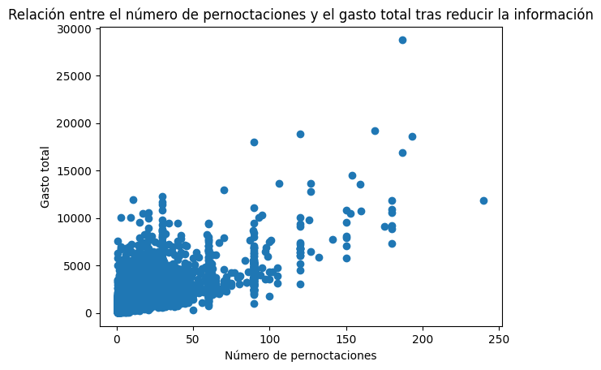

### 0.7 Matriz de similaridad

Hacemos la matriz de similaridad para ver la correlación entre las variables del dataset.

## 1. APLICACIÓN DE ALGORITMOS DE CLUSTERING JERÁRQUICO

### 1.2 Algoritmos de clustering jerárquico

Correspondente con:

- **Tarea 2.1**: Aplica al menos 2 algoritmos de clustering jerárquico sobre el dataset proporcionado probando y evaluando los efectos de la distancia utilizada (euclídea, coseno…)
-  **Tarea 2.2**:Analiza a determinadas profundidades la distribución de los ejemplos en el dendograma. ¿Es uniforme la distribución independientemente de la profundidad?
- **Tarea 2.3**:¿Cómo afectan las diferentes métricas de distancia a la estructura del dendrograma?

#### Algoritmo 1 

Se ha aplicado ***linkage*** con las siguientes medidas: 

- Euclídea
- Manhattan

Creando los respectivos dendogramas

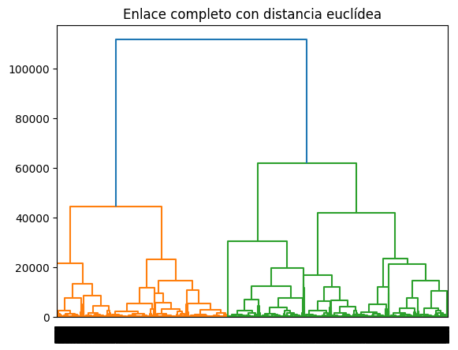

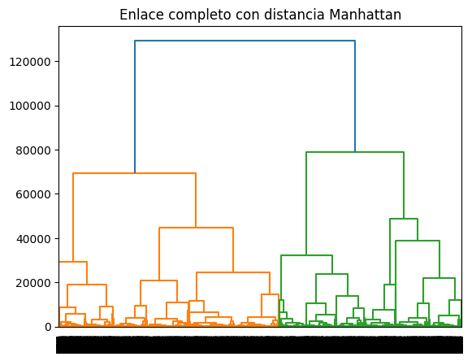

#### Algoritmo 2

Se ha apliado ***AgglomerativeClustering*** con las mismas distancias que en el anterior generando así los siguientes diagramas:

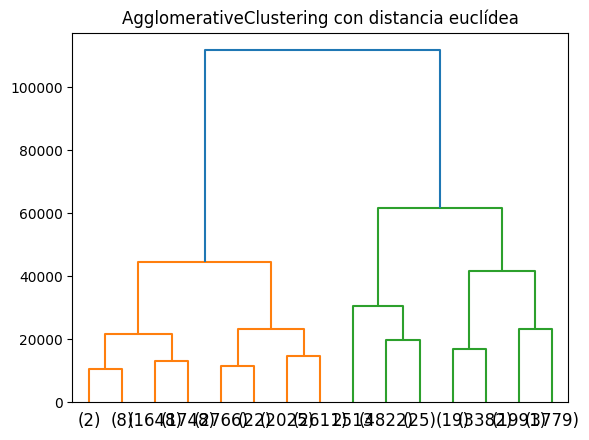

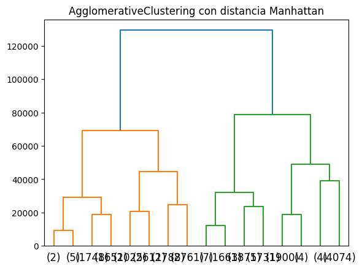

#### Conclusiones

Como se puede observar por los dendogramas el algoritmo ***AgglomerativeClustering*** es el que mejor encuentra los clusters y la única diferencia entre las distancias de éste es que en la euclídea se encuentra un cliuster más

### 1.3 Calidad del clustering

Corresponidente con:

- **Tarea 2.4**: Utiliza por lo menos dos índices de calidad de clustering y y analiza sus resultados.

En este apartado se ha cambiado al algoritmo ***BIRCH***.

#### Silhouette Score

La calidad va variando según va aumentando la distancia como se representa en la siguiente gráfica:

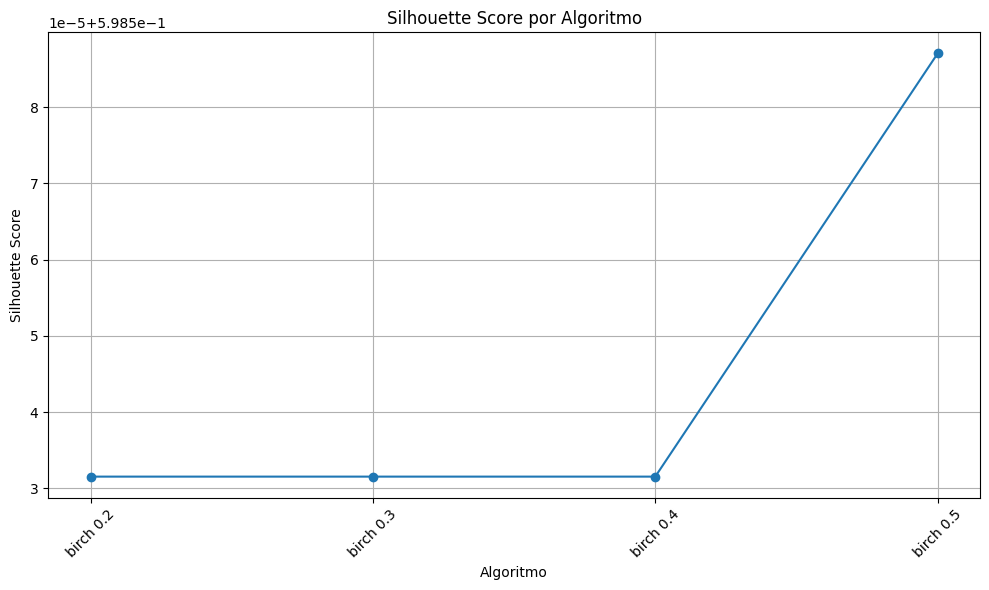

Se puede observar que el valor ronda el 0.58 lo cual indica que las estructuras encontradas son razonables

#### Índice de Davies

La calidad va aumentando (en el caso de este índice el valor va bajando) conforme se va aumentando la distancia.

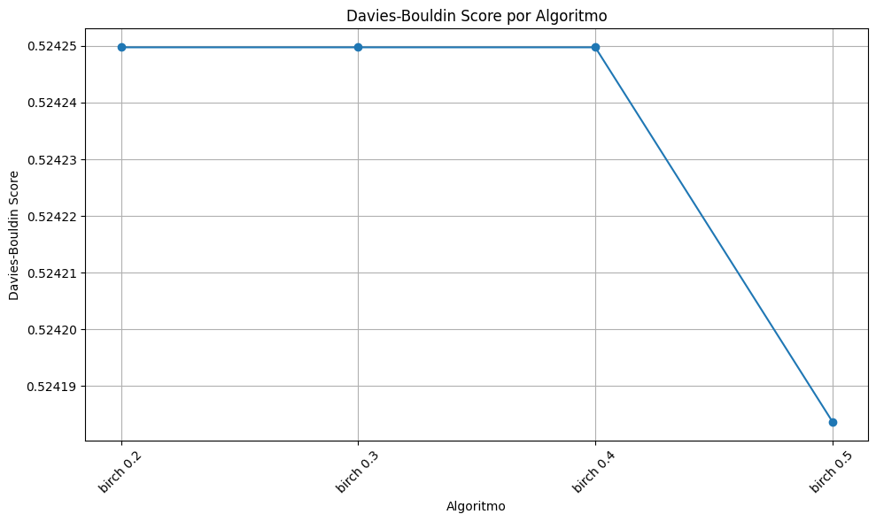

### 1.4 Número de clusters 

Correspondiente con:

- **Tarea 2.5**: ¿Cuál es el número óptimo de clusters? ¿por qué?

Con el algoritmo BRICH se ha ido aumentando el número de clusters, mientras que la distancia se mantenía, de modo que evaluando el reesultado mediante el método de la silueta el que mayor Silhouette Score obtenga será nuestro cluster óptimo. 

Como se puede ver en la gráfica, **el número óptimo de clusters es 10**

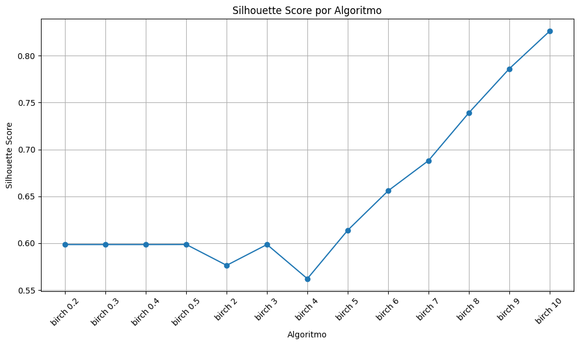

### 1.5 Predicción

Correspondiente con:

- **Tarea 2.6**: Identificar perfil gasto viajero

Se elige K-Means por:

1. **Facilidad de Implementación y Escalabilidad**: KMeans es un algoritmo simple, fácil de implementar y computacionalmente eficiente, lo que lo hace apropiado para conjuntos de datos grandes. Esto es crucial para el análisis de datos extensos como el de gasto turístico, que puede contener un gran número de registros.

2. **Interpretación de Resultado**s: KMeans produce agrupaciones (clusters) con centroides definidos, lo que facilita la interpretación y análisis de los grupos resultantes. Cada cluster representa un grupo de viajeros con características similares en términos de gasto, lo que ayuda a entender los diferentes perfiles de gasto.

2. **Variables Numéricas**: KMeans funciona bien con datos numéricos, como el número de noches en el alojamiento. Estas variables son fundamentales para la agrupación basada en similitudes en los patrones de gasto.

3. **Estructura Euclidiana**: KMeans se basa en la minimización de las distancias Euclidianas entre puntos y centroides, lo que puede ser adecuado si los datos de entrada tienen estructuras claras y bien definidas en el espacio Euclidiano.

3. **Facilidad para Determinar el Número de Clusters**: Métodos como Elbow Method o Silhouette Score pueden ayudar a seleccionar el número óptimo de clusters en KMeans, lo que permite encontrar la cantidad adecuada de perfiles de gasto

## 2. APLICACIÓN DE ALGORITMOS DE CLUSTERING PARTICIONAL

### 2.1 Preprocesado

Correspondiente con :

- **Tarea 3.1**: Realiza el pre-procesamiento necesario para poder aplicar algoritmos de clustering particional. 

Se hace lo mismo que en el primer apartado ya que no hace falta escalar el dataset ya que se pierde calidad en el algoritmo.

### 2.2 Establecer número de clusters y variación 

Correspondiente con:

- **Tarea 3.2**: Establece el número más adecuado de clusters para el dataset proporcionado. Ayúdate de los métodos vistos (al menos 2) en la asignatura, así como de gráficas para justificar la decisión. Compara los resultados que obtienes con cada método.

- **Tarea 3.3**: ¿Cómo varía la calidad del clustering con diferentes valores de 'K'?

Es cogemos dos métodos: 

- Método del codo

- Metodo de la silueta

Como se ve en las siguientes gráficas el número de clusteres óptimo es 10.

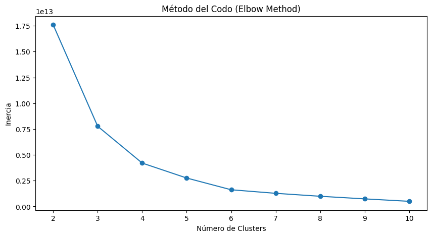
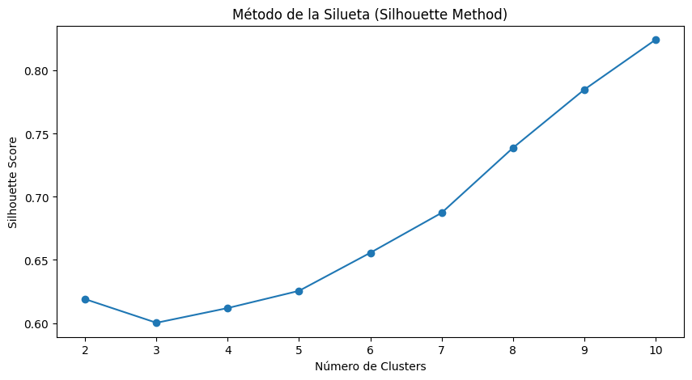

Como se ve en la gráfica el valor 10 de cluesters tiene un índice de Silhouette Score de más o menos 0.8 lo que quiere decir que las estructuras encontradas son sólidas 

### 2.3 Estadísticas de los clusters

Correspondiente con: 

- **Tarea 3.4**: Con el número más adecuado de clusters, ayúdate de estadísticas para analizar a los viajeros incluidos en cada cluster

- **Tarea 3.5**:  Compara los resultados obtenidos con K-means y el clustering
aglomerativo/jerárquico. Discute las ventajas y desventajas de cada método en
diferentes tipos de datos.

Según las estadisticas más o menos se incluyen unos 5000 viajeros por cluster.

K-Means y BRICH consiguen más o menos como se observa en las gráficas la misma calidad pero K-Means es más eficente y tiene menor tiempo de ejecución.

## 3. APLICACIÓN ALGORITMOS DE DENSIDAD

### 3.1 Preprocesado

Correspondiente con :

- **Tarea 4.1**:  Realiza el pre-procesamiento necesario para poder aplicar algoritmos de densidad.

El preprocesamiento es el mísmo que en el primer apartado ya que si no, se pierde calidad.

### 3.2 Establecer radio (eps) y número de puntos minimo adecuado

Correspondiente con: 

- **Tarea 4.2**: Establece el radio (eps) y número de puntos mínimo número más adecuado de clusters para el dataset proporcionado.

Se ha ido viendo dieferentes valores y finalmente nos quedamos con el ``` eps = 1.0 ``` y ```min_samples= 15``` ya que son los únicos valores que nos arrojan resultados equilibrados.

### 3.3 Calidad del clustering

Correspondiente con:

- **Tarea 4.3**: ¿Cómo varía la calidad del clustering con diferentes valores de 'eps' y de minpoints?

- **Tarea 4.4**: Utiliza por lo menos dos índices de calidad de clustering y analiza sus resultados.

- **Tarea 4.5**: ¿Cuál es el número óptimo de clusters? ¿por qué?

Veamos las gráficas para comentarlas

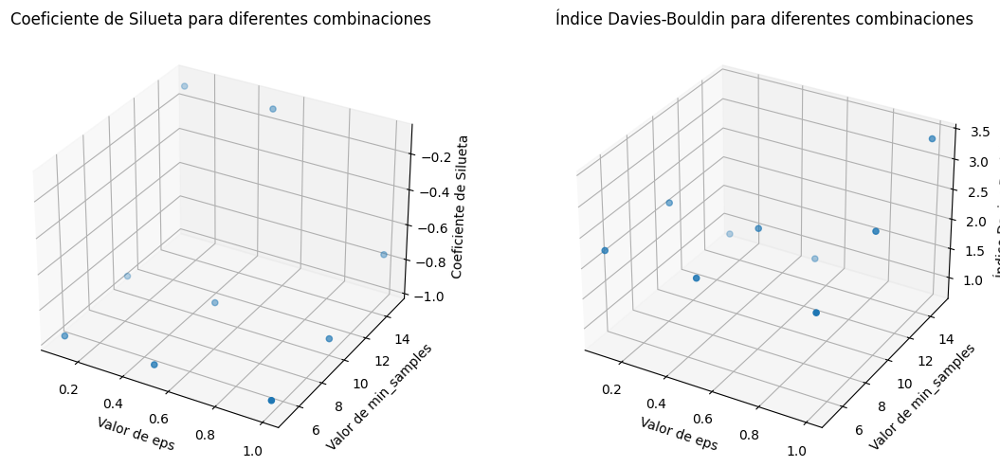

Como podemos observar los valores de los índices de calidad son muy malos, esto de debe o a que los datos no son lo suficentemente buenos o a las métricas del DBSCAN

## 4. OTROS

###  4.1 Preprocesado

El preprocesamiento es el mísmo que en el primer apartado ya que si no, se pierde calidad.

### 4.2 HDBSCAN
Correspondiente con: 

- **Tarea 5.1**: Emplea otros algoritmos como HDBScan y compara con otros algoritmos su rendimiento.

Comparando con el K-Means el HDBScan es mucho peor que el primero mencionado.

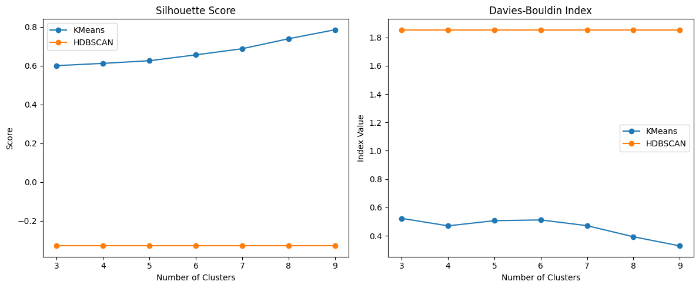

### 4.3 Kmodes

Correspondiente con: 

- **Tarea 5.2**: Emplea otros algoritmos como K-modes y compara con otros algoritmos su rendimiento.

En este caso K-Modes es mejor que HDBScan pero no llega a alcanzar el rendimiento que nos proporcina K-Means.

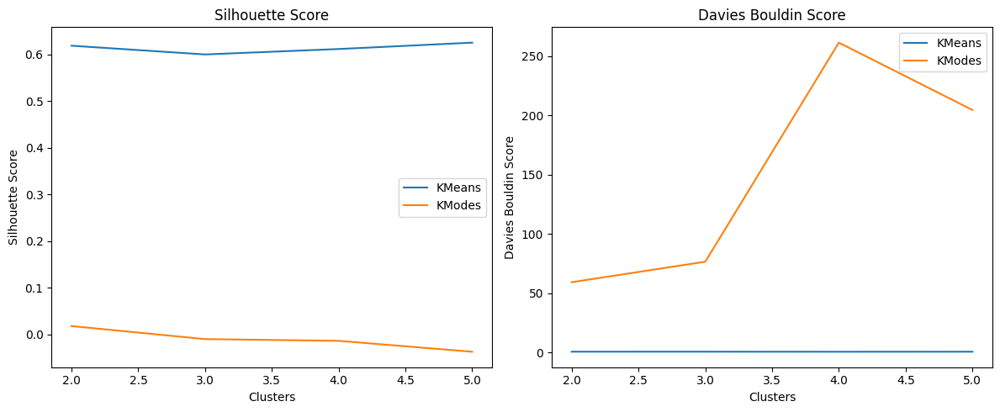
